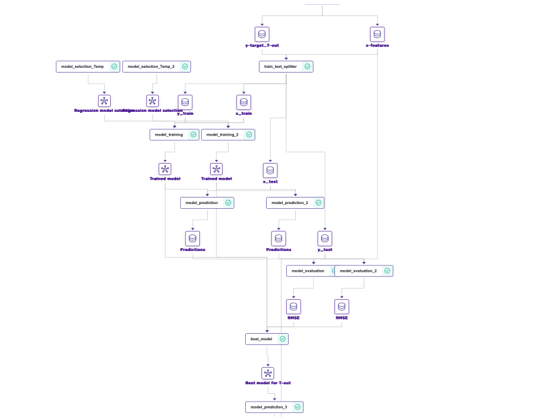
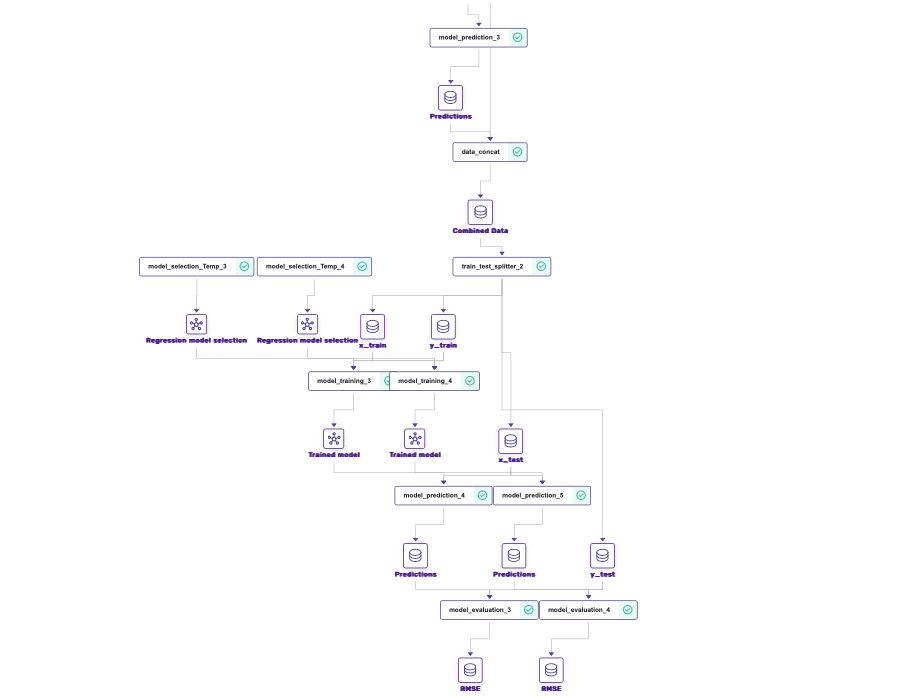

# swhML

SWH for micro-small industries

Thesis: PREDICTION OF THERMAL PARAMETERS FOR FLAT PLATE SOLAR WATER HEATER BY MACHINE LEARNING

Student: Faizan Hafez

Supervisors: Prof. Kamlesh Parmar,
             Dr. Nirmal Parmar, PhD

